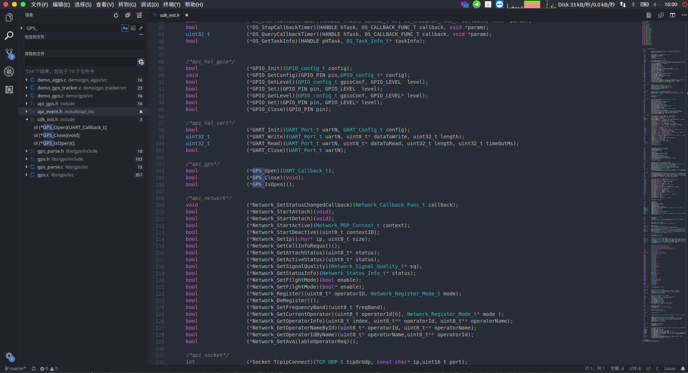

常见问题 Q&A
=====

## 为什么`git clone`到本地后编译无法通过

工程使用git进行版本管理,为了让工程的体积不会随着更新疯狂增加,所以使用了子模块,关于子模块的内容可以自行搜索.

因此,执行`clone`命令后,需要执行`git submodule update --init`命令对子模块进行初始化和更新,否则SDK文件不全.
或者`clone`时使用`--recursive`参数,如果这种方式无法克隆,则使用上面先克隆再更新子模块的方式可以解决

## 为什么Windows下面和linux下面生成的lod文件大小不一样?

本工程生成的lod文件是字符文件,不是二进制文件,所以会比较大,
总所周知,字符文件在windows和linux下默认的换行符是不同的,
linux下使用的换行符是`LF(\n)`,windows下使用`CRLF(\r\n)`,
所以每多一个换行符,windows生成的lod文件就会比linux生成的会多一个字节,

因此,windows上生成的lod文件会比linux上的lod文件大一点,但是不会对程序有任何影响

## 为什么没有IDE,没有像keil一样的IDE么?

没有提供IDE,提供单独的工具链(编译链接工具)和下载软件,
编写软件可以自由选择编辑器,

比如使用[VS Code](https://code.visualstudio.com/),支持跳转,对于没法跳转的可以使用全局搜索,速度很快很方便

也可以[用eclipse开发](https://github.com/Ai-Thinker-Open/GPRS_C_SDK/issues/202)

## 为什么有时会无法下载程序到模块?

程序不要进入休眠模式,不要使用`while(1){};`代码,
以及串口的问题,
可以尝试:按复位键,模块启动后(下载串口的数据通信指示灯开始闪烁)立马点击下载按钮

## 不用TF卡,可以把数据存到内部flash中么?

SDK集成了文件系统,文件系统就是flash上的,所以对文件系统的操作就可以看成是对flash的操作,可以把配置文件存到文件系统中.

所以,不用TF卡也可以通过文件系统的API将数据存到flash文件系统中

## 支持那些网络? 2G基站关闭了怎么办?

模块使用RDA8955这款芯片,支持4频段:800/900/1800/1900MHz,
在国内建议使用移动卡,移动未宣布关闭2G基站,联通已经决定关闭2G基站
其它地区建议先进行测试

## 为什么有时候会重启?

重启一般是因为两个原因造成的
* 电源供电不足,导致断电重启
* 系统程序bug

很多情况下都是因为电源问题造成的, 蜂窝网要求电源设计为2A,如果达不到就可能会出现联网通信或打电话或者信号差的时候就会重启

如果使用C SDK编译debug版本的固件,死机后不会重启,会阻塞(除了手动设置了看门狗),如果是debug版本也重启了并且没有自己使用过看门狗功能,那一定是电源的问题
如果使用release版本或者添加了看门狗功能,有可能是程序出现了问题,一般是指针越界操作导致的

## 文档和代码不一致或者文档没有说明怎么办?

在开发中的代码可能文档更新不及时,尽量先看已有的文档,在api每个文档的开头都会有重要提示,如果不看可能会遇到坑,

工程的代码也尽量写得比较简单易懂,可以多看看demo下的例程和.h文件,

再不懂则可以提交issue或者论坛发问或者发邮件询问

## 如何获取IMEI?

可以使用SDK中的API获取,或者用手机扫描模块屏蔽壳的二维码即可得到

## 为什么总是提示SIM无法识别或者掉卡?

* 检查是否有SIM卡
* 检查SIM接触是否正常,触电不能有胶覆盖(比如有涂三防漆涂到了触电的例子)
* 检查SIM卡线路走线是否正规,尽量离模块近一点,周围不要有干扰,模块的天线引脚和SIM卡引脚相隔比较近,注意走线使其不相互影响

## 为什么低功耗时达不到说的2mA?

模块低功耗可以达到2mA的电流是没错的,8955通过降低主频以及关闭外设来降低功耗,
如果还有部分外设处在使用中的情况,电流可能不会降下来,以及在信号弱的地方为了保持网络连接,可能会有电流上升的情况

如果进入飞行模式,则GSM/GPRS协议栈关闭,也会大大降低电流,但是无法打电话发短信上网,其它功能正常使用

所以,要使用低功耗尽量关闭外设,保持信号良好

## 为什么GPS会漂,不是说好的定位精度5米么?

GPS在空旷的环境中可以有比较理想的效果,在有遮蔽的地方会对定位精度有影响

## 可以使用arduino开发么?

目前不可以,没有移植arduino库,有兴趣学习的可以自己尝试移植试试

## 为什么定时器的时间不是十分准确?

定时器是软件定时器,不是硬件定时器,不适用在高精度的定时任务上

