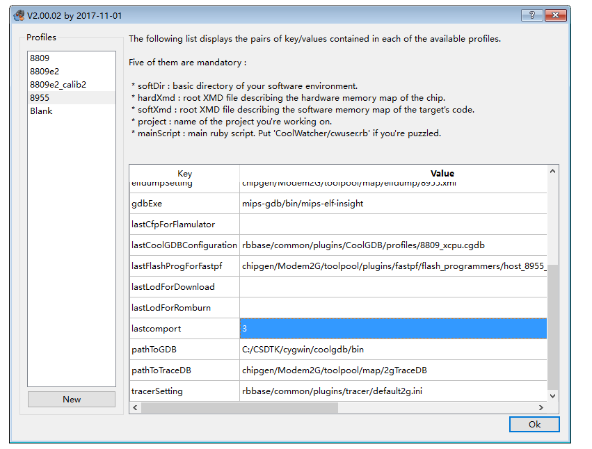
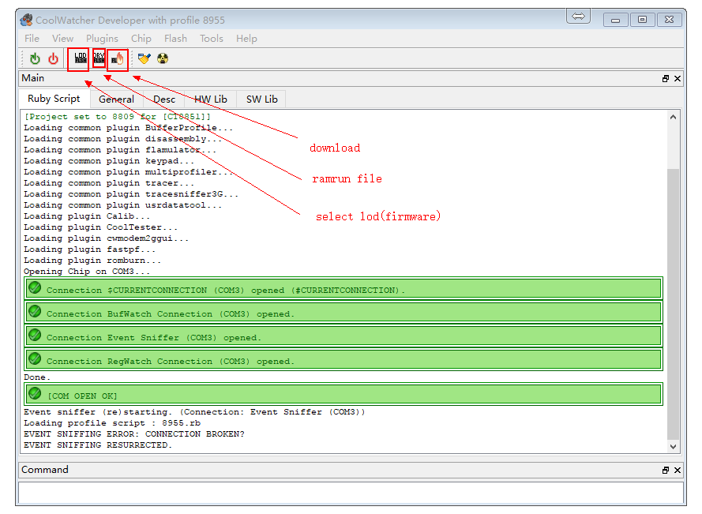
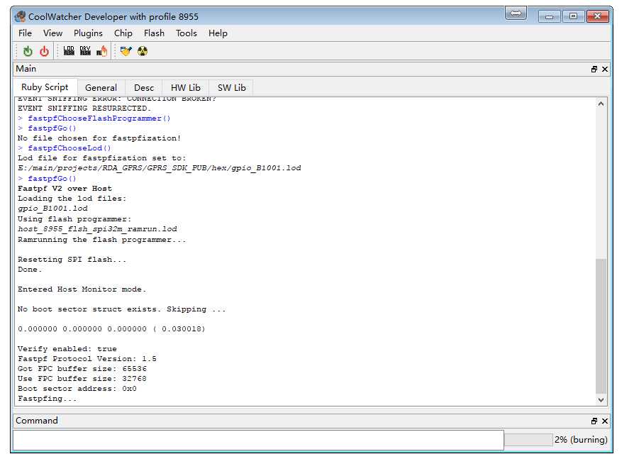
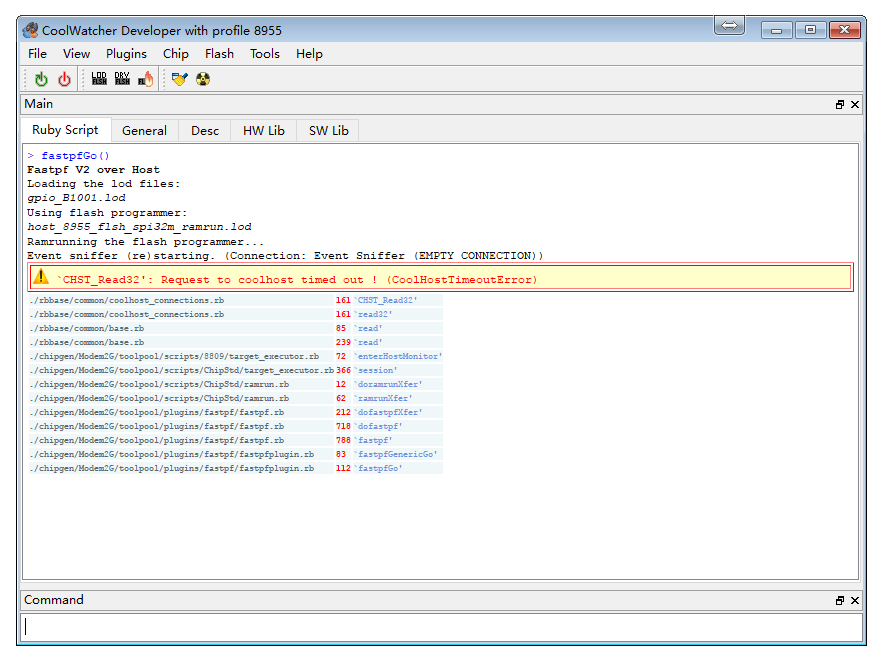
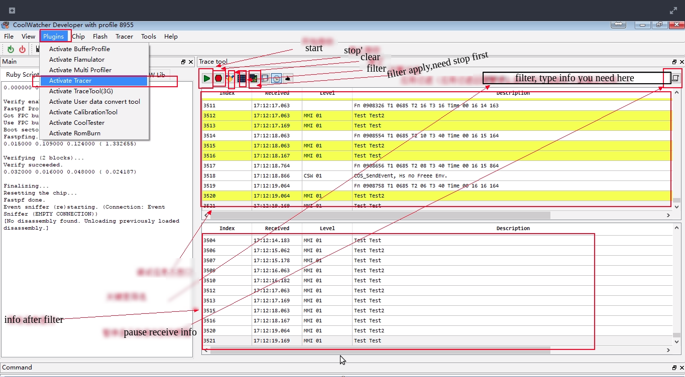
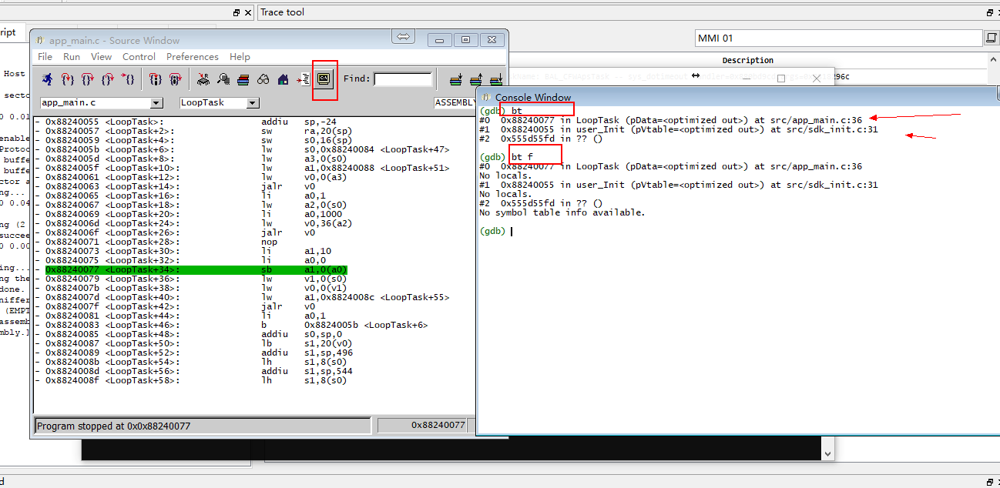

GPRS Burn(Download) and Debug
======


## hardware connection

* Module Debugging The download interface is the `HST` interface. The pins` HST_RX` and `HST_TX` are respectively connected to the` TX` and `RX` pins of the USB to serial module (cross connection,` HST_RX` then `TX `)

* The power can be connected to the lithium battery voltage (ie 3.8v ~ 4.2v) (VBAT pin), can also be connected to 5v power supply (5v input pin or USB input), it should be noted that, if using lithium battery power supply You need to press <kbd> POWER KEY </kbd> for about 3 seconds to power on the module, USB power will automatically power on the power. In the download or debugging to ensure that has been switched on.


## Linux

* Install dependences

```
sudo apt install build-essential libqt4-qt3support itcl3 itk3 iwidgets4
```

* Create a link file for serial port as follow, and later you can fill in the coolwatcher's chart with `1`,the `COM1` must upper-case

```
sudo ln -s /dev/ttyUSB0 comport/COM1
```

* Then double click `coolwatcher` to run software

## Download steps

* Update `coolwatcher` to the latest version(coolwatcher is in the CSDTK folder)

* Open`CSDTK/cooltools/coolwatcher.exe` or `CSDTK/cooltools/coolwatcher` in Linux

* Select the 8955 for the options on the left, and fill the `lastcomport` chart with port number of HOST serial (` HST`) for the connection module. Then click ok



* Wait for the connection to succeed, the following screen appears



> If there is a connection failure, please refer to [coolwatcher can not connect reason] (#coolwatcher can not connect) part


* If first time open coolwatcher, click <kbd>DRY</kbd> icon，select the file whose name contains ` 8955 ramrun spi32m .lod`,（onder project `platform/ramrun` or coolwatcher's `cooltools\chipgen\Modem2G\toolpool\plugins\fastpf\flash_programmers` folder）。
Only need to set once, will remember later.

* Click <kbd>lod</kbd> icon, select fimware(*.lod) in the `hex` folder in the GPRS project,  There's two hex file,(`*_B*.lod` and `*_flash.lod`), you must burn the bigger one to dev board at the first time, then you can just burn the little one to reduce the doanload time. And you must download the bigger if you update the SDK version.

* Click <kbd>download</kbd> icon to download, then progress bar can be find in the right corner



> if burn fail,refer to  [coolwatcher Download Fail](#coolwatcher-download-fail) sectioin.


## Coolwatcher Connect Fail


Solutions:

* Ensure that the serial port and the module are connected (note that the USB port on the development board is not a serial port, and the serial port is connected to the `HST_RX` and` HST_TX` pins through the USB to serial port module)

* Ensure that the serial port is not occupied by other software

* Check the serial number is wrong, set the serial number when restarting, or do not restart click the lower right corner <kbd> CoolHost </kbd> icon to set </br>


Then click <kbd> connect </kbd> to reconnect the serial port

## Coolwatcher Download Fail



* [ramrun file error](https://github.com/Ai-Thinker-Open/GPRS_C_SDK/issues/1), try using project directory `platform / ramrun` and coolwatcher` CSDTK\cooltools\chipgen\Modem2G\toolpool\plugins\fastpf\flash_programmers` directory `*_8955_*_spi32m_ramrun.lod`

* It is possible that the program has entered sleep mode and is reset by the module reset button before downloading

* Serial port may be lost, the lower right corner of the taskbar double-click the <kbd>CoolHost</kbd> icon to reconnect the serial port, and then download

* Serial port other problems, unplug the USB to serial port module re-insert the computer, and then re-connect the serial port

* Boot into the program into the sleep mode or thread using the `while (1)` dead loop and completely take up resources, such as:
```
void LoopTask(VOID *pData)
{
    uint64_t count = 0;
    while(1)
    {
        ++count;
        if(count == 3000)
        {
            count = 0;
            Trace(1,"Test Test");
        }
    }
}
```

**Solution:** Press the module reset button, the USB transfer serial port module data transmission indicator flashing (that is, the module has been started and send data to the serial port) press the download button for a second, not to try on how many times
In order to completely prevent this problem, it is recommended not to write such a program, it is best to use the time in the loop trigger or delay at least `OS_Sleep ()`)

```
void LoopTask (VOID * pData)
{
    uint64_t count = 0;
    while (1)
    {
        ++ count;
        if (count == 3000)
        {
            count = 0;
            Trace (1, "Test Test");
            OS_Sleep (100);
        }
    }
}
```
or
```
void LoopTask (VOID * pData)
{
    uint64_t count = 0;
    while (1)
    {
        ++ count;
        if (count == 3000)
        {
            count = 0;
            Trace (1, "Test Test");
            
        }
    }
    OS_Sleep (1);
}
```
Or event handling
```
void AppMainTask (VOID * pData)
{
    API_Event_t * event = NULL;
        
    while (1)
    {
        if (OS_WaitEvent (mainTaskHandle, & event, OS_TIME_OUT_WAIT_FOREVER))
        {
            EventDispatch (event);
            OS_Free (event-> pParam1);
            OS_Free (event);
        }
    }
}
```

## Debug

#### Log Tool: Tracer


* View debug information: Open `Plugins`-> `Active Tracer`, the interface and function as shown below



Need to set up Tracer before use, set as follows 1 ~ 6 steps:


* The program needs to output the debugging information You can call `Trace (uint16_t nIndex, PCSTR fmt, ...)` in `api_debug.h`, where` nIndex` corresponds to `MMI 01` ~` MMI 16 `

#### Tracer Problems

* Sometimes I expect the debug data is not displayed, it may be the upper right corner of the pause to display the latest button, forgot to turn off! !

* Tracer may not power on when system just power on, some early info may can not diaply


#### Crash handling

Here simulated an exception, null pointer assignment exception, the general emergence of such problems are the problem of indiscriminate flight!
Open GBD, and set the select elf file


Open the GBD terminal and enter `bt` or` bt f` to view the message



It should be noted that this GDB does not support set break point with this software(coolwatcher), break point only can be set in the code.

See more problems in [issue](https://github.com/Ai-Thinker-Open/GPRS_C_SDK/issues?utf8=%E2%9C%93&q=)


