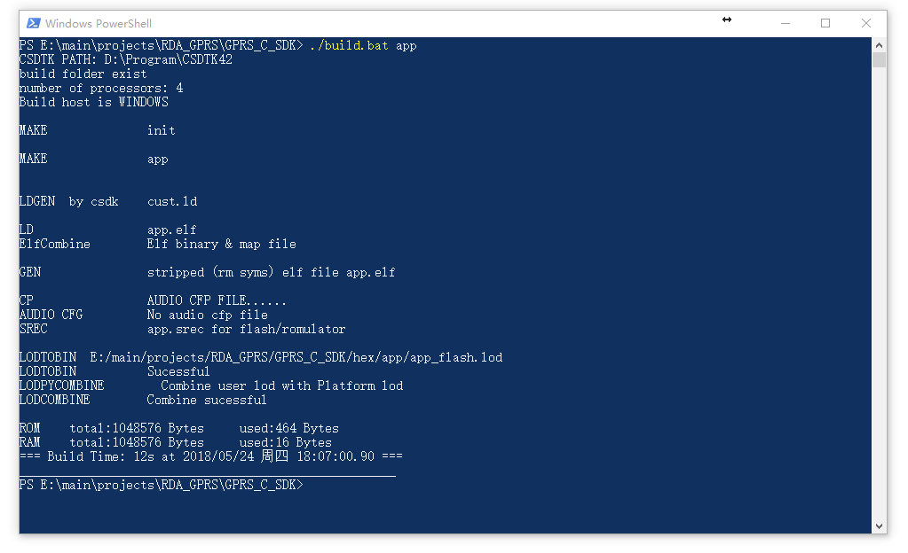

GPRS C SDK Build environment installation
====

## Pay Attention

**important, please read first**

* SDK does not have a specific IDE, and the user chooses the code editor to edit the code.

* When modifying the code, you **must not** use the notepad and writing board that windows brings. Please use a more professional editor (recommended as [vscode](https://code.visualstudio.com/), [sublime](https://www.sublimetext.com/), [atom](https://atom.io/), [eclipse](http://www.eclipse.org/downloads/packages/eclipse-ide-cc-developers/oxygen2), source insight, or other editors you are familiar with. )

* Please modify the editor settings. The end of the file symbol is set to UNIX style (`<LF>` (`\n`) end), and file encoding is `UTF-8`

* if you are cloned using git, set the git at pull not to convert `<LF>` to `<CR><LF>`, set the method reference [here](https://www.jianshu.com/p/305a138883d4)

## Download tool chain, debug tool and SDK

* Download CSDTK4.2: [baidu cloud](https://pan.baidu.com/s/16ZIQ9YbZdcVz-zvpzEFXbA),[MEGA cloud](https://mega.nz/#!uKAlRA7Z!UPHn3ZoLY8X33iMIKcBcUYFwrhmNYe-x_dyOdrm_d6I)，[direct link](http://test.ai-thinker.com/csdk/CSDTK42.7z)

* Get SDK
  * [download SDK](https://github.com/Ai-Thinker-Open/GPRS_C_SDK/releases)
  * or clone by git:`git clone https://github.com/Ai-Thinker-Open/GPRS_C_SDK.git --recursive` (pay attention `--recursive` is needed, or compile will fail for lake of files)
  * Check C_SDK `platform/csdk` folder, there should be some folders and file, if not, you may get source code with wrong way, check and download again
  

## installation

* Decompression to a folder, such as `C:\CSDTK`, **path please DO NOT bring Chinese!**
* Run `config_env_admin.bat` file in CSDTK to set environment value
> What the script does is to create an environment variable named `GPRS_CSDTK42_PATH`, which has a variable directory value of CSDTK. If the script fails, you can build it by yourself
> 


## Compile

* Decompress the CSDK downloaded to `GPRS_C_SDK` folder into a directory, such as `C:\GPRS_C_SDK`, use the underscore(_) instead of minus(-).

* Step into CSDK folder(`C:\GPRS_C_SDK`），right click mouse in th blank space in the folder with <kbd>shift</kbd> key pressed, then open with powersheel of cmd.


Type `./build.bat app` or `build.bat app` to build app project, ensure our environment is ok.



**If comes with `NO CSDTK` error**, you may need to restart you system(mostly appears on Win7).

Then you can use `./build.bat` script to build project:
  * `./build.bat $PROJ`:compile app module，e.g.:`./build.batsh app` to compile the source code of app folder
  * `./build.bat demo $PROJ`:compile demo project, e.g.:`./build.bat demo gpio` to compile gpio demo
  * `./build.bat clean $PROJ`:clear the build files of `$PROJ`
  * `./build.bat clean all`:clear all the build files
  * `./build.bat demo $PROJ release`:build a release version, e.g.:`./build.bat demo gpio release`，if the last parameter is not `release`, it will be default to `debug` version. **The GDB can be used to debug errors after system crashed in `debug` version, but `release` version can not, watch dog activate in release version,it will auto restart system when system crashed!**

**e.g.: **
```
./build.sh demo gpio
```
A `build` folder will be generated after compile, there's two `*.lod` files in th `hex` folder, it's the target file that burn(download) to dev board

* **about target hex file(*.lod)** 

There's two hex file,(`*_B*.lod` and `*_flash.lod`), you must burn the bigger one to dev board at the first time, then you can just burn the little one to reduce the doanload time. And you must download the bigger if you update the SDK version


## Other Problems

* If error occured, please compare the documents carefully to see if the operation is wrong，and find in [issue](https://github.com/Ai-Thinker-Open/GPRS_C_SDK/issues?utf8=%E2%9C%93&q=)

* Way A: github [add issue](https://github.com/Ai-Thinker-Open/GPRS-C-SDK/issues/new)

* Way B: [Ai-Thinker forum](http://bbs.ai-thinker.com/forum.php?mod=forumdisplay&fid=37)


