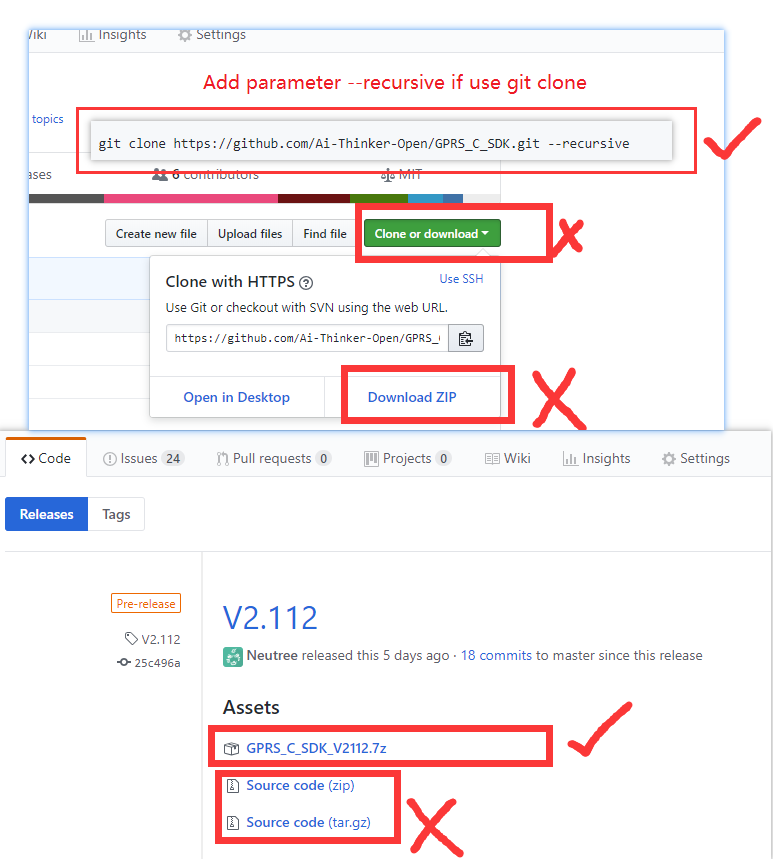

GPRS C SDK Build environment installation on Linux
====

## Pay Attention

**important, please read first**

* SDK does not have a specific IDE, and the user chooses the code editor to edit the code.(Like [vscode](https://code.visualstudio.com/), [sublime](https://www.sublimetext.com/), [atom](https://atom.io/), [eclipse](http://www.eclipse.org/downloads/packages/eclipse-ide-cc-developers/oxygen2), source insight, or other editors you are familiar with. )

* Please modify the editor settings. The end of the file symbol is set to UNIX style (`<LF>` (`\n`) end), and file encoding is `UTF-8`

* if you are cloned using git, set the git at pull not to convert `<LF>` to `<CR><LF>`, set the method reference [here](https://www.jianshu.com/p/305a138883d4)

## Download tool chain, debug tool and SDK

* Download CSDTK4.2 Linux version: 
  * [baidu cloud](https://pan.baidu.com/s/1FzEvkt9z41QdvUdLxZJvug)
  * [MEGA cloud](https://mega.nz/#!LHhxWTrJ!rR7RzMxOOq4zwfGhpVLfe7DmdwEfhIiTLArb8OFqJM0)
  * [direct link](http://test.ai-thinker.com/csdk/CSDTK42_Linux.tar.gz)

* Get SDK
  * [download SDK](https://github.com/Ai-Thinker-Open/GPRS_C_SDK/releases)
  * or clone by git:`git clone https://github.com/Ai-Thinker-Open/GPRS_C_SDK.git --recursive` (pay attention `--recursive` is needed, or compile will fail for lake of files)
  * Check C_SDK `platform/csdk` folder, there should be some folders and file, if not, you may get source code with wrong way, check and download again
  

## Installation

### Install dependences for compile tool

```
sudo apt install build-essential gcc-multilib g++-multilib libzip-dev zlib1g lib32z1
```

### Install dependences for coolwatcher

```
sudo apt install build-essential libqt4-qt3support itcl3 itk3 iwidgets4
```

and maybe other compatible libs in ther latest ubuntu

```
sudo apt install libpng12-0 libusb-0.1-4
```


### CSDTK set up

* Create a project folder e.g. `~/projects`

```
mkdir ~/projects
```

* Decompress `CSDTK42_Linux.tar.gz` to a folder, `~/software/CSDTK` for example, and then execute `setup.sh`, the first parameter is the location of CSDTK, the second parameter is the location of your projects

```
cd ~/software
tar -xzvf CSDTK42_Linux.tar.gz
cd CSDTK
./setup.sh ./ ~/projects
```


### Compile

* Decompress the CSDK downloaded to `GPRS_C_SDK` folder into a directory, such as `~/projects/GPRS_C_SDK`, use the underscore(_) instead of minus(-).

* Check  if the SDK have full files, check `platform/csdk` folder, if no `debug` and `release` folders, you download the wrong SDK file, please download again in [release page](https://github.com/Ai-Thinker-Open/GPRS_C_SDK/releases) or clone by command `git clone https://github.com/Ai-Thinker-Open/GPRS_C_SDK.git --recursive`

* compile

```
cd ~/projects/GPRS_C_SDK
./build.sh demo gpio
```

if you put you GPRS project in the `projects folder`(you set by command `./setup.sh ./ ~/projects` before), you can use a script to go to the project folder quikly as follow

```
work GPRS_C_SDK
./build.sh demo gpio
```

Then you can use `./build.sh` script to build project:
  * `./build.sh $PROJ`:compile app module，e.g.:`./build.sh app` to compile the source code of app folder
  * `./build.sh demo $PROJ`:compile demo project, e.g.:`./build.sh demo gpio` to compile gpio demo
  * `./build.sh clean $PROJ`:clear the build files of `$PROJ`
  * `./build.sh clean all`:clear all the build files
  * `./build.sh demo $PROJ release`:build a release version, e.g.:`./build.sh demo gpio release`，if the last parameter is not `release`, it will be default to `debug` version. **The GDB can be used to debug errors after system crashed in `debug` version, but `release` version can not, watch dog activate in release version,it will auto restart system when system crashed!**

e.g.:
```
./build.sh demo gpio
```
A `build` folder will be generated after compile, there's two `*.lod` files in th `hex` folder, it's the target file that burn(download) to dev board

* **about target hex file(*.lod)** 

There's two hex file,(`*_B*.lod` and `*_flash.lod`), you must burn the bigger one to dev board at the first time, then you can just burn the little one to reduce the doanload time. And you must download the bigger if you update the SDK version


## Other Problems

* If error occured, please compare the documents carefully to see if the operation is wrong，and find in [issue](https://github.com/Ai-Thinker-Open/GPRS_C_SDK/issues?utf8=%E2%9C%93&q=)

* Way A: github [add issue](https://github.com/Ai-Thinker-Open/GPRS-C-SDK/issues/new)

* Way B: [Ai-Thinker forum](http://bbs.ai-thinker.com/forum.php?mod=forumdisplay&fid=37)


