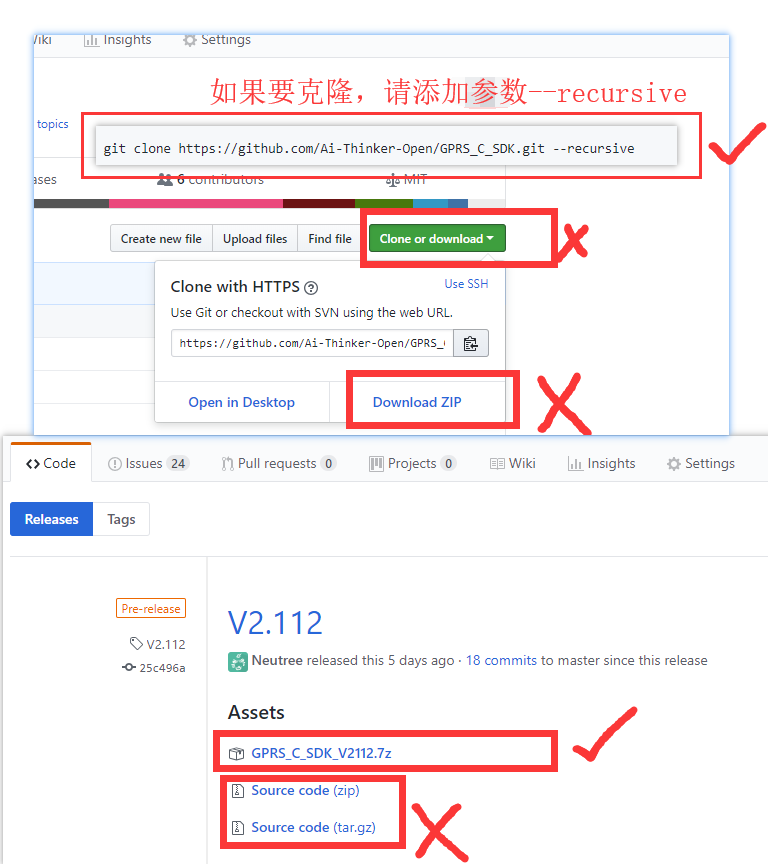
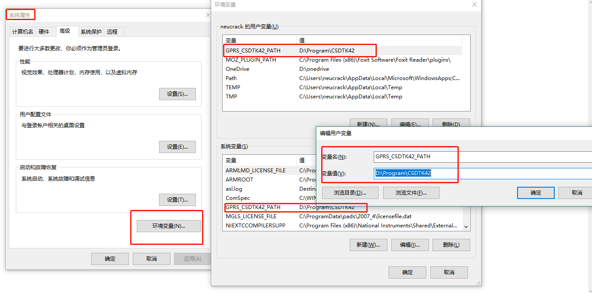
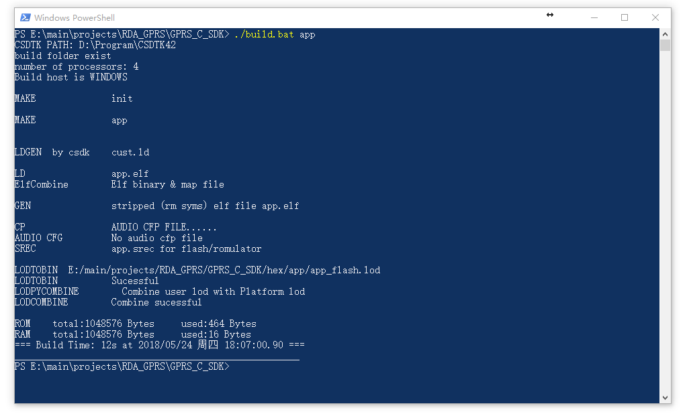

GPRS C SDK 开发环境搭建
====

## 注意

**重要，请先阅读**
* SDK没有特定的IDE，用户自己选择代码编辑器编辑代码。

* 在修改代码时，一定不能使用windows自带的记事本和写字板，请使用更加专业的编辑器(推荐使用如[vscode](https://code.visualstudio.com/)，[sublime](https://www.sublimetext.com/)，[atom](https://atom.io/)，[eclipse](http://www.eclipse.org/downloads/packages/eclipse-ide-cc-developers/oxygen2),source insight等，或者其它你熟悉的编辑器。)
> 比如使用VS Code, 它支持函数跳转等基本功能(在vscode里面搜索C/C++插件安装),多使用搜索功能(侧边栏搜索图标)会很方便

* 请修改编辑器设置，文件结尾符号设置为unix风格(`<LF>`(`\n`)结尾)(设置方法请自行到网络查找)

* 如果你是使用git进行克隆，请设置git在pull时不将`<LF>`转换为`<CR><LF>`，设置方法参考[这里](https://www.jianshu.com/p/305a138883d4)

## 下载工具链以及下载调试工具及SDK

* 下载CSDTK4.2：[百度云下载](https://pan.baidu.com/s/16ZIQ9YbZdcVz-zvpzEFXbA)，[MEGA网盘下载](https://mega.nz/#!uKAlRA7Z!UPHn3ZoLY8X33iMIKcBcUYFwrhmNYe-x_dyOdrm_d6I)，[直接链接](http://test.ai-thinker.com/csdk/CSDTK42.7z)

* [下载SDK](https://github.com/Ai-Thinker-Open/GPRS_C_SDK/releases)


> **注意**： 下载完请检查`platform/csdk`文件夹下是否包含`debug`、`release`文件夹，没有说明下载文件不全，请重新下载完整的SDK
> 如果使用`git`克隆，因为工程使用了子模块，请添加`--recursive`参数，否则克隆下来的文件不全无法编译成功

## 安装

* 解压到某个文件夹,比如`C:\CSDTK`,**路径请不要带中文！**
* 运行CSDTk目录下的`config_env_admin.bat`文件来设置环境变量
> 这个脚本做的事情就是新建一个名为`GPRS_CSDTK42_PATH`的环境变量，变量值为CSDTK的目录路径。 如果脚本建立失败也可以自己手动建
> 


## 编译

* 解压下载到的CSDK为`GPRS_C_SDK`文件夹放到某个目录下，比如`C:\GPRS_C_SDK`，**请使用下划线(_)而不是减号(-)**

* 进入CSDK文件夹（`C:\GPRS_C_SDK`），按住shift，在文件夹内空白处鼠标右键单击，选择cmd打开或者powershell打开，如图：


使用`./build.bat app` 或者 `build.bat app`来编译工程，测试环境是否可用，如果正常，会出现以下结果：



如果提示`NO CSDTK,Please install CSDTK first!`，则是环境变量没有生效（在win7下可能会出现），可以重启电脑以生效

保证环境可以使用后，就可以在CMD或powershell窗口中使用`build.bat`脚本来编译工程，有以下参数：
  * 使用 `./build.bat $PROJ`来编译你的应用模块，如 `./build.batsh app` 则是编译app目录下的源码
  * 使用 `./build.bat demo $PROJ` 来编译demo目录下的特定例程，比如`./build.bat demo gpio`
  * 使用 `./build.bat clean $PROJ` 清除`$PROJ`目录的中间文件
  * 使用 `./build.bat clean all` 清除所有中间文件
  * 使用 `./build.bat demo $PROJ release` 来生成release版本，比如`./build.bat demo gpio release`，
  如果最后一个参数不是`release`，则默认是`debug`版本， `debug`版本在死机后会停止运行并可以使用GDB调试，而**release版本加入了看门狗功能，在死机时会自动重启系统**，所以**实际投入使用时请使用release版本以防止出现bug时死机**，测试时使用debug版本

**比如：**
```
./build.sh demo gpio
```
进行编译，编译会生成一个`build`目录，编译完成会在`hex`目录下生成两个格式为`lod`的文件，这就是我们用来下载到开发板的目标文件

* **目标文件说明** 

两个文件一大一小，在第一次下载时需要下载大文件(`*_B*.lod`)即可，第二次和以后为了减少下载时间都只需要下载小文件(`*_flash.lod`)即可，更新SDK后需要重新下载大文件

## 其它问题

* 如果遇到问题，请仔细对比文档，看操作是否有错，也可以在[issue](https://github.com/Ai-Thinker-Open/GPRS_C_SDK/issues?utf8=%E2%9C%93&q=)里找有没有先例，如果仍然有错，可以到安信可论坛提问或者github提交issue

* 方式一：github[添加issue](https://github.com/Ai-Thinker-Open/GPRS-C-SDK/issues/new)

* 方式二：[安信可论坛讨论](http://bbs.ai-thinker.com/forum.php?mod=forumdisplay&fid=37)


