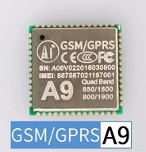

A9
===

## Features

  * RDA 32 bit RISC core, frequency up to 312MHz, with 4k instruction cache, 4k data cache
  * Up to 29 GPIOs (with two download pins)
  * Calendar (Real Time Clock) with alarm
  * 1 USB1.1 device interface
  * 2 UART interface with flow control (+1 download/debug serial port)
  * 2 SPI interface
  * 3 I 2 C interface
  * 1 SDMMC controller (interface)
  * 2 ADC interface, 10 bits
  * 32Mb (4MB) SPI NOR Flash
  * 32Mb (4MB) DDR PSRAM
  * 8kHz, 13Bits/sample ADC mic
  * 48kHz, 16bits/sample DAC Audio
  * Power Management Unit: Lithium battery charge management, integrated DC-DC and LDOs, variable IO voltage
  * 18.8 x 19.2 mm SMD package
  * Quad-band GSM/GPRS (800/900/1800 / 1900MHz)
  * calls
  * SMS service

## Hardware

* Product specification: [A9 Product specification doc](http://wiki.ai-thinker.com/_media/b102ps01a2_a9g_product_specification.pdf)
* User manual: [user manual(Chinese)](http://wiki.ai-thinker.com/_media/a6_a9_a9g_gprs_user_manual.pdf)
* Hardware files:[A9/A9G hardware files](http://wiki.ai-thinker.com/_media/gprs/a6a9a9g_hardware_info.rar)
* Module pin map(A9 and A9G  are compatible with each other)

