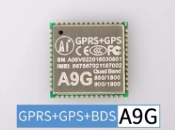

A9G
===

## Features

  * All features of A9
  * GPS integrated(GK9501),connected with GPRS chip internal through the serial port(UART2)

## Hardware

### GSM/GPRS

cpu:RDA8955

* Product specification: [A9G Product specification doc](http://wiki.ai-thinker.com/_media/b102ps01a2_a9g_product_specification.pdf)
* User manual: [user manual(Chinese)](http://wiki.ai-thinker.com/_media/a6_a9_a9g_gprs_user_manual.pdf)
* Hardware files:[A9/A9G hardware files](http://wiki.ai-thinker.com/_media/gprs/a6a9a9g_hardware_info.rar)
* Module pin map(A9 and A9G  are compatible with each other)

### GNSS(GPS)

GK9501

* Document and tools of GK9501: download: [baidu cloud](https://pan.baidu.com/s/1MjLXpZT-XC9XrNhU5DcTcg),[mega cloud](https://mega.nz/#!bWh3gIQL!0mCuDqh-8oXK0rkxPjFdvdL2WDpATvhF7r6XSH5fNDU)

