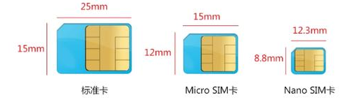

SIM Card
===

In order to ensure the uniqueness of each device's identity in GSM/GPRS network, a SIM card is needed. Now normal SIM card and eSIM are supported, the former is a card with a chip and contacts, with different sizes: Standard SIM, Micro SIM, Nano SIM; the latter is just a chip, have small size can be directly installed inside the device.

