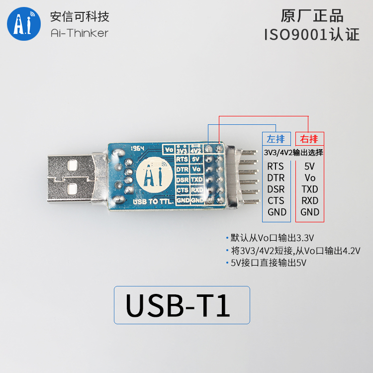

USB serial port module
===

Burn(Download) program to the development board through the serial port. It needs a USB serial port chip, which can be bought in Taobao or other Electronic shopping mall.

Do not recommend the use of PL2303 or CH34 chip USB to the serial port module, may appear driving problems or lack of current, CP2102 is a better choice, buy links: [Ai-Thinker USB Serial](https://item.taobao.com/item.htm?spm=a1z10.3-c-s.w4002-16491566008.9.7abb4853nE52fD&id=565546260974)

