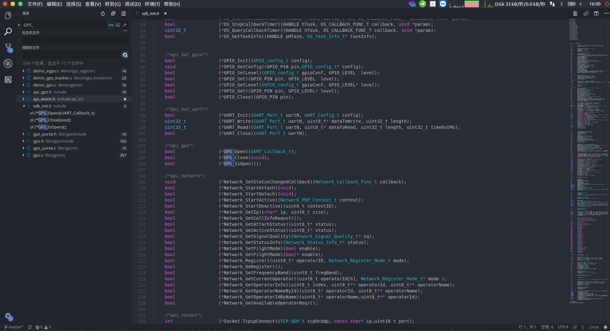
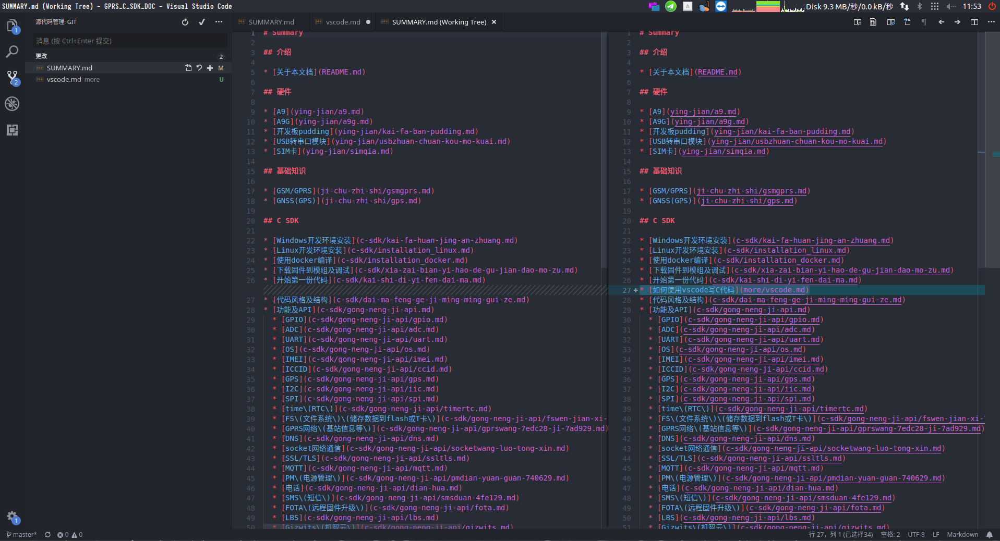

如何使用vscode提高查看代码和写代码效率
======

* 下载vscode: https://code.visualstudio.com , 并安装

* 选择 `文件`--> `打开文件夹`, 打开工程文件夹(比如这里的`GPRS_C_SDK`)

* 左边侧边栏点击c源文件, vscode会自动识别到是c文件,会自动采用c语言语法高亮,右下角会自动识别文档格式(比如`GPRS_C_SDK`使用`UTF-8`),以及行结尾符为`LF`(即`\n`)
  第一次打开c文件,vscode会提示安装`C/C++`扩展,这个扩展可以为vscode添加右键函数跳转等其它IDE中有的基本功能

* 打开C文件会提示安装`C/C++`扩展,如果没有安装,可以在左边侧边栏扩展选项中搜索`C/C++`然后安装,安装完成后点击重载页面即可

* 查看代码和编写代码时,如果需要查看函数定义,可以使用右键`转到定义`,查看头文件可以右键`Peek Declaration`,
如果找不到,可以多使用<kbd>Ctrl+F</kbd>来搜索文件, 以及使用左边栏的搜索按钮(或者快捷键<kbd>Ctrl+Shif+F</kbd>)来搜索整个工程, 
使用`C/C++`插件的跳转功能以及文件搜索和全局搜索这几个功能, 可以大大提高代码阅读和编写效率

* 左边有`大纲`,可以看到代码的大纲

* 更多有意思的功能有兴趣可自行探索,比如集成了git版本管理,可以很方便地对比文件更改

